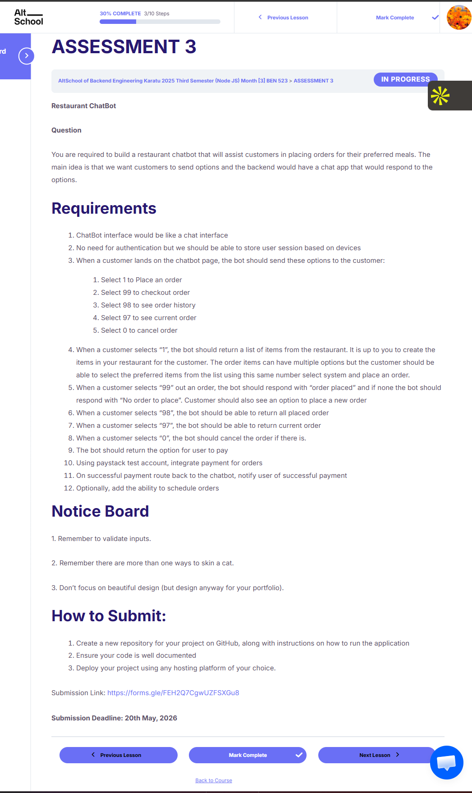

# altschool-s03-a03 - Restaurant Chatbot
AltSchool Backend Engineering Third Semester Assignment 3

A restaurant chatbot API built with NestJS and TypeScript. Customers interact via a chat interface (identified by device ID), browsing a menu, building an order across multiple messages, and completing payment via Paystack. Sessions are persisted in Supabase so order state survives across messages.



## Features

- Stateful chat sessions keyed by device ID (no login required)
- Menu browsing and multi-item order building across multiple messages
- Checkout flow with email collection and Paystack payment link generation
- Order history and current-order review at any time
- Order cancellation
- Paystack webhook handler to mark orders as paid on successful charge
- Health check endpoint

## Prerequisites

Before running this project, make sure you have the following:

- [Node.js](https://nodejs.org/) (v18 or higher)
- [npm](https://www.npmjs.com/) (comes with Node.js)
- [Git](https://git-scm.com/)
- A [Supabase](https://supabase.com) project (free tier works)
- A [Paystack](https://paystack.com) account (test keys work)

## Getting Started

### 1. Clone the Repository

```bash
git clone https://github.com/akcumeh/altschool-s03-a03.git
cd altschool-s03-a03
```

### 2. Install Dependencies

```bash
cd backend
npm install
```

### 3. Set Up Environment Variables

Copy `backend/.env.example` to `backend/.env` and fill in the values:

```bash
cp backend/.env.example backend/.env
```

Your `.env` should contain:
- `SUPABASE_URL`: Your Supabase project URL
- `SUPABASE_KEY`: Your Supabase anon key
- `PAYSTACK_SECRET_KEY`: Your Paystack secret key
- `PORT`: Port to run on (default: `3000`)

### 4. Set Up the Database

Run the schema SQL in your Supabase dashboard (Dashboard > SQL Editor) to create the required tables (`sessions`, `menu_items`, `orders`, `order_items`).

### 5. Start the Application

```bash
# from backend/
npm run start:dev   # development (watch mode)
npm run start:prod  # production
```

The server will start on `http://localhost:3000`.

## API Reference

Full Postman documentation: **[View on Postman](https://documenter.getpostman.com/view/38823654/2sBXwmQsjE)**

Base URL (local): `http://localhost:3000`

Base URL (live): [`https://kays-kitchen-kappa.vercel.app`](https://kays-kitchen-kappa.vercel.app/health)

### Chat
- `POST /chat` - Send a message to the chatbot

  Body: `{ "deviceId": "string", "option": "string" }`

  Chat options:
  - `1`: Place an order (shows menu)
  - `<number>`: Select a menu item (while ordering)
  - `99`: Checkout (prompts for email, returns payment link)
  - `98`: View order history
  - `97`: View current order
  - `0`: Cancel current order

- `POST /chat/webhook`: Paystack webhook (marks order paid on `charge.success`)

### System
- `GET /health`: Health check

## Project Structure

```
altschool-s03-a03/
├── backend/                      # NestJS API
│   ├── src/
│   │   ├── chat/
│   │   │   ├── chat.controller.ts    # POST /chat, POST /chat/webhook
│   │   │   ├── chat.module.ts
│   │   │   └── chat.service.ts       # Core chatbot state machine
│   │   ├── menu/
│   │   │   ├── menu.module.ts
│   │   │   └── menu.service.ts       # Menu item queries and formatting
│   │   ├── orders/
│   │   │   ├── orders.module.ts
│   │   │   └── orders.service.ts     # Order CRUD
│   │   ├── payment/
│   │   │   ├── payment.module.ts
│   │   │   └── payment.service.ts    # Paystack integration
│   │   ├── session/
│   │   │   ├── session.module.ts
│   │   │   └── session.service.ts    # Session get-or-create and state updates
│   │   ├── supabase/
│   │   │   ├── supabase.module.ts
│   │   │   └── supabase.service.ts   # Supabase client
│   │   ├── app.controller.ts         # GET /, GET /health
│   │   ├── app.module.ts
│   │   └── main.ts
│   ├── api/
│   │   └── index.ts              # Vercel serverless entry point
│   ├── .env.example
│   └── package.json
├── frontend/                     # Next.js 16 chat UI
│   └── (see frontend/README.md)
└── s03-a03.png
```

## Chat Flow

```
idle
 └─ 1 -> show menu -> ordering
         └─ <n> -> add item (loop)
         └─ 99 -> awaiting_email
                  └─ <email> -> payment link sent -> idle
         └─ 0 -> cancel -> idle
 └─ 98 -> order history
 └─ 97 -> current order
 └─ 0 -> cancel
```

## Stack Used

- **Node.js** (**NestJS**) - Web framework
- **TypeScript** - Type safety
- **Supabase** (PostgreSQL) - Database and session storage
- **Paystack** - Payment processing
- **class-validator** - Request validation

## Author

Thank you for reading this far! Connect with me on:

- Website - [Angel Umeh | Software Engineer](https://angelumeh.dev)
- GitHub - [Angel Umeh](https://github.com/akcumeh)
- Twitter - [@akcumeh](https://x.com/akcumeh)
